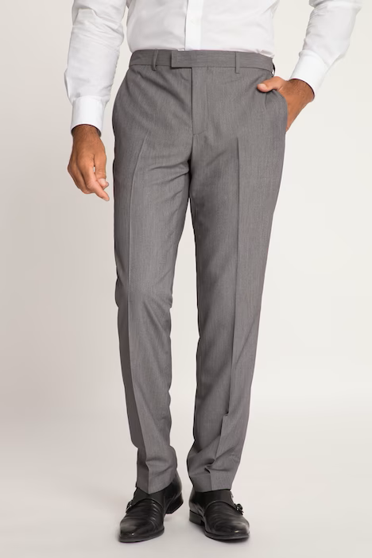
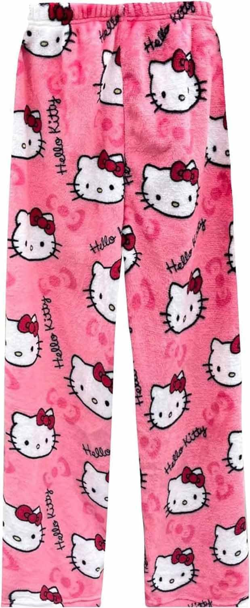
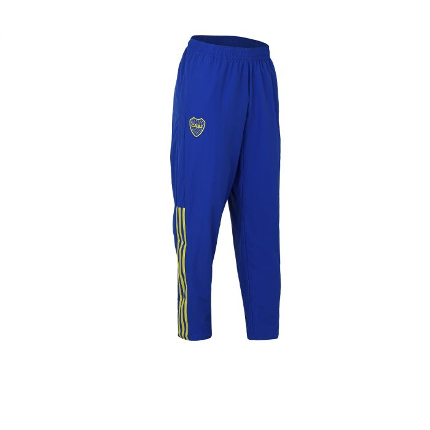
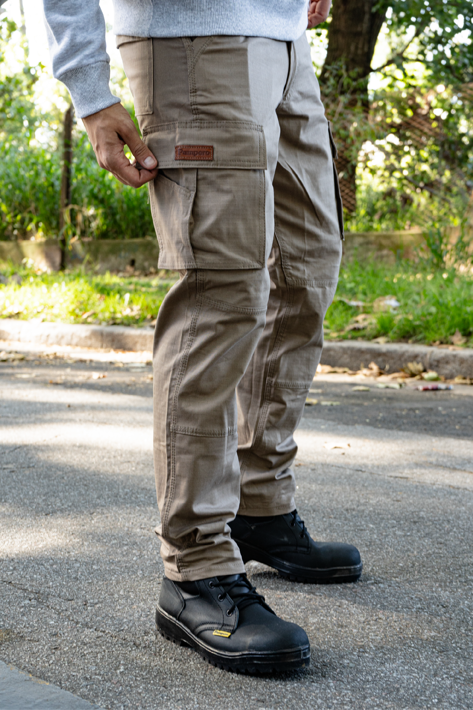

# Pantalones de vestir

	

Se suelen usar para salidas elegantes y cenas.

# Pantalones de dormir

Se suelen usar para descansar o dormir, algo más íntimo y privado.

# Pantalones de deportes

Se suelen usar para entrenar o para hacer deportes.

# Pantalones de uso casual

Suelen usarse para ir a merendar, ir a la facultad y cosas comunes del día a día.

## Precios

Hay una variedad amplia de precios, todos dependiendo de la calidad y de la marca. Varias marcas están puestas abajo en los links que contienen estos precios.

**Gama baja y media (USD):**
- 20 
- 30
- 40
- 50

**Gama alta y de lujo (USD):**
- 100
- 120
- 150
- 200

## Páginas de pantalones

Dejo los links abajo de las páginas en las cuales podrías comprar pantalones de todo tipo y de toda calidad:

- [Lee Jeans](http://leejeans.ar/)
- [Levi's](http://levi.com.ar/)
- [Orso Bianco](http://orsobianco.com.ar/)
- [Moov](https://www.moov.com.ar/)
- [Lefur](http://lefur.com.ar/)
