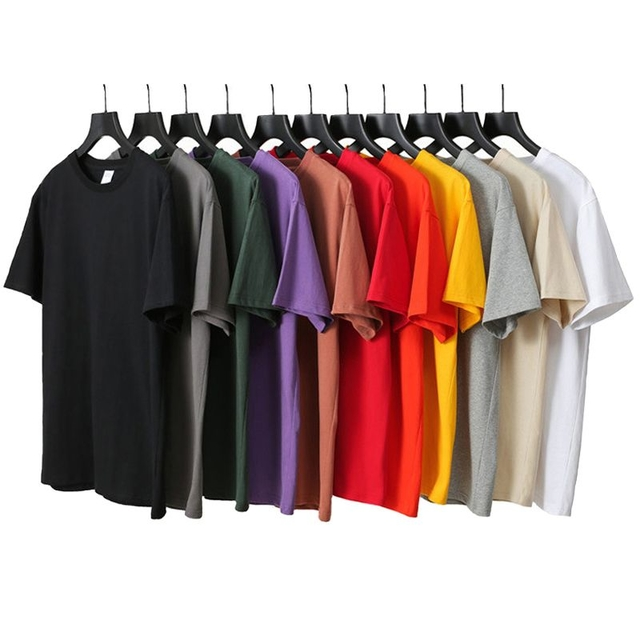
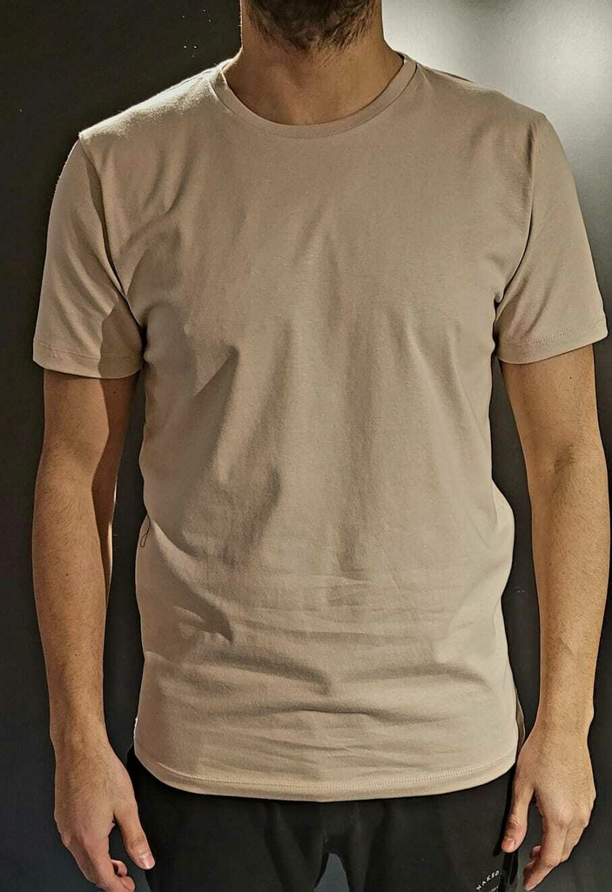
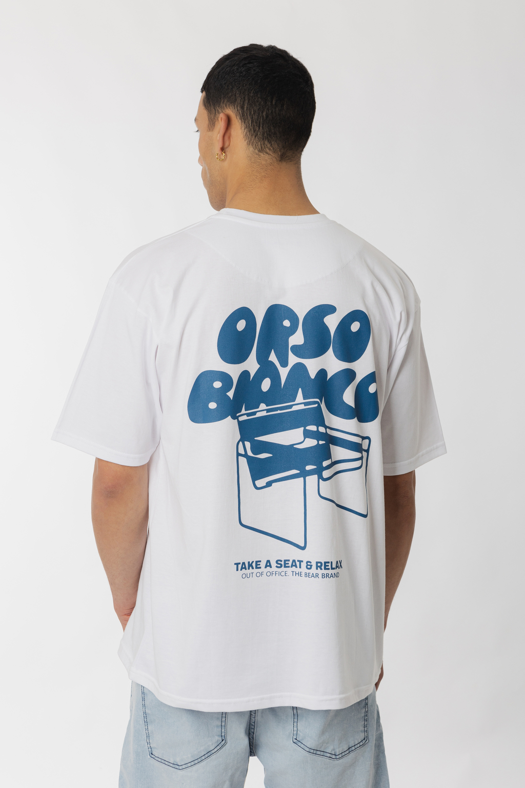
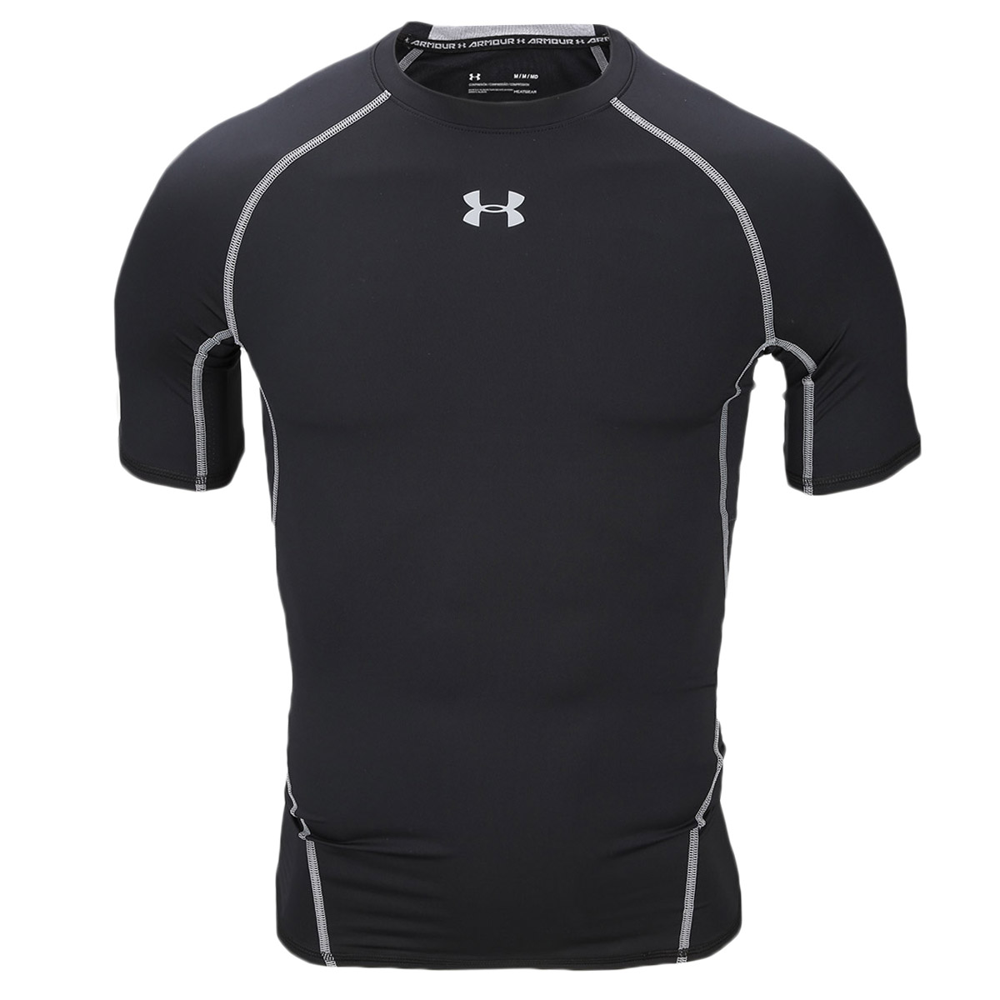

#Remeras

Las remeras son una prenda esencial en cualquier guardarropa.
Su versatilidad permite usarlas tanto en contextos informales como en situaciones más formales, dependiendo del tipo y el estilo. En esta guía se presentan tres tipos principales de remeras: básicas, estampadas y deportivas.
Junto con sus características y precios promedio en Estados Unidos.

#Remeras básicas

#Remeras estampadas

#Remeras deportivas

##Precios

Gama baja y media usd

- 15
- 17
- 20
- 25 usd

Gama alta y de lujo usd

- 50
- 175
- 225 
- 250
 
##paginas de remeras

[Marca polo](https://poloclub.com.ar/)

[Marca zara](https://www.zara.com/ar/)

[Marca h&m](https://www2.hm.com)

[Marca calvinklein]https://www.calvinklein.us/en

[Marca underarmour](https://www.underarmour.com.ar/)
