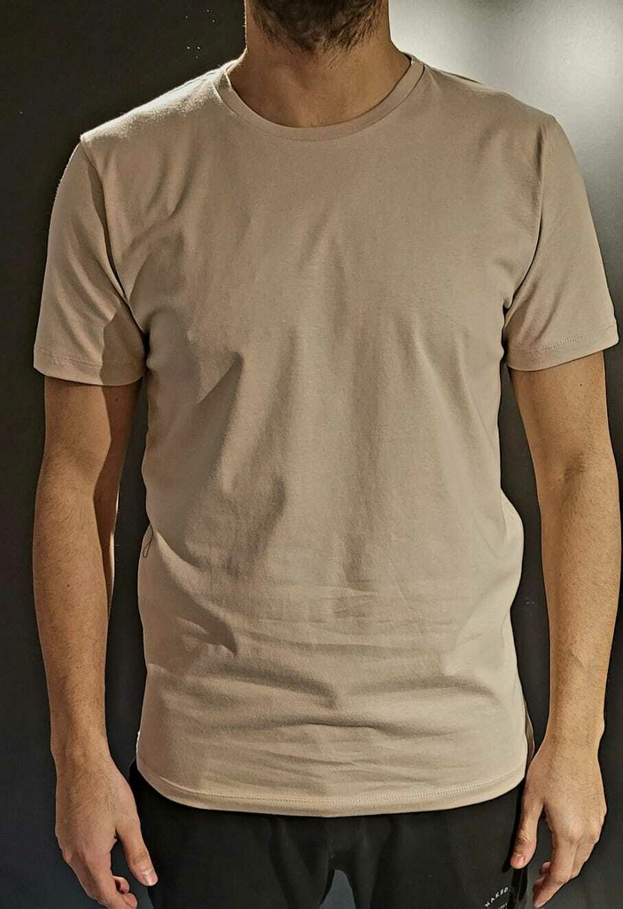
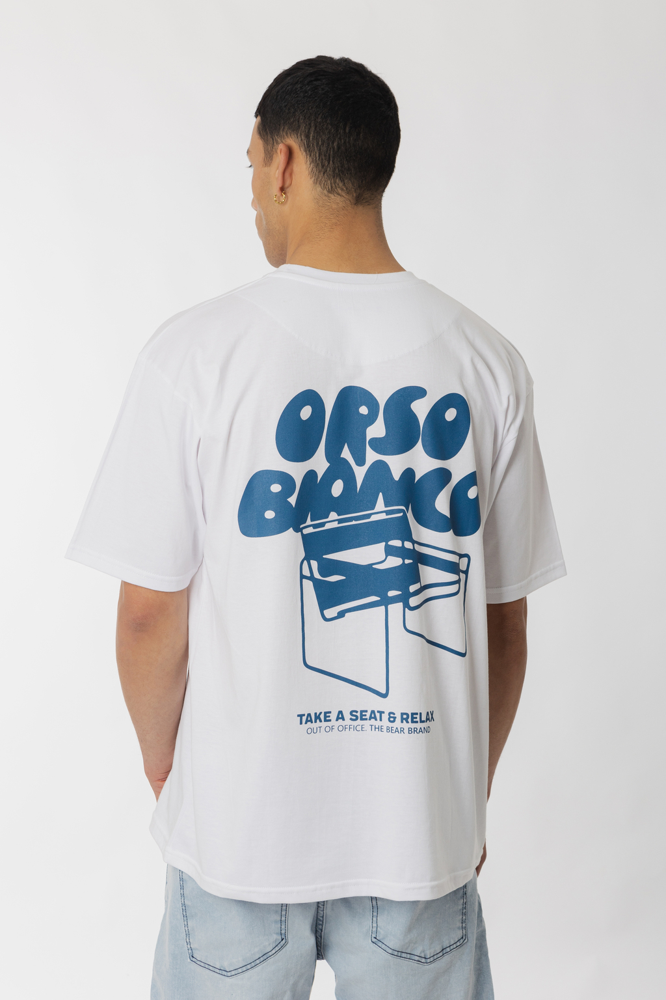
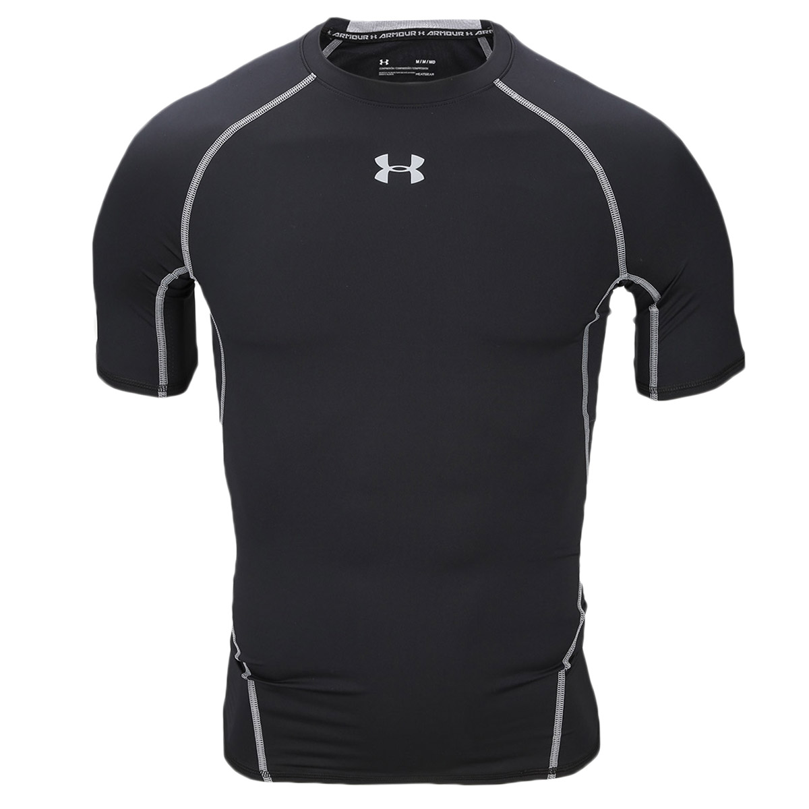

# Remeras

Las remeras son una prenda esencial en cualquier guardarropa.  
Su versatilidad permite usarlas tanto en contextos informales como en situaciones más formales, dependiendo del tipo y el estilo. En esta guía se presentan tres tipos principales de remeras: básicas, estampadas y deportivas.  
Junto con sus características y precios promedio en Estados Unidos.

# Remeras básicas

Son ideales para el uso diario gracias a su comodidad y versatilidad. Se fabrican generalmente en algodón y vienen en colores lisos, sin diseños llamativos. Son económicas y combinan con casi todo tipo de prendas.

# Remeras estampadas

Estas remeras se destacan por sus diseños gráficos, frases o ilustraciones. Reflejan personalidad, gustos o intereses, y son muy populares entre adolescentes y adultos jóvenes. Suelen usarse en contextos casuales.

# Remeras deportivas

Diseñadas para actividades físicas, están hechas con telas técnicas que permiten una mejor transpiración y movilidad. Se ajustan al cuerpo y ofrecen confort durante el ejercicio o actividades al aire libre.

## Precios

**Gama baja y media (USD):**
- 15
- 17
- 20
- 25

**Gama alta y de lujo (USD):**
- 50
- 175
- 225 
- 250

## Páginas de remeras

- [Marca Polo](https://poloclub.com.ar/)
- [Marca Zara](https://www.zara.com/ar/)
- [Marca H&M](https://www2.hm.com)
- [Marca Calvin Klein](https://www.calvinklein.us/en)
- [Marca Under Armour](https://www.underarmour.com.ar/)
