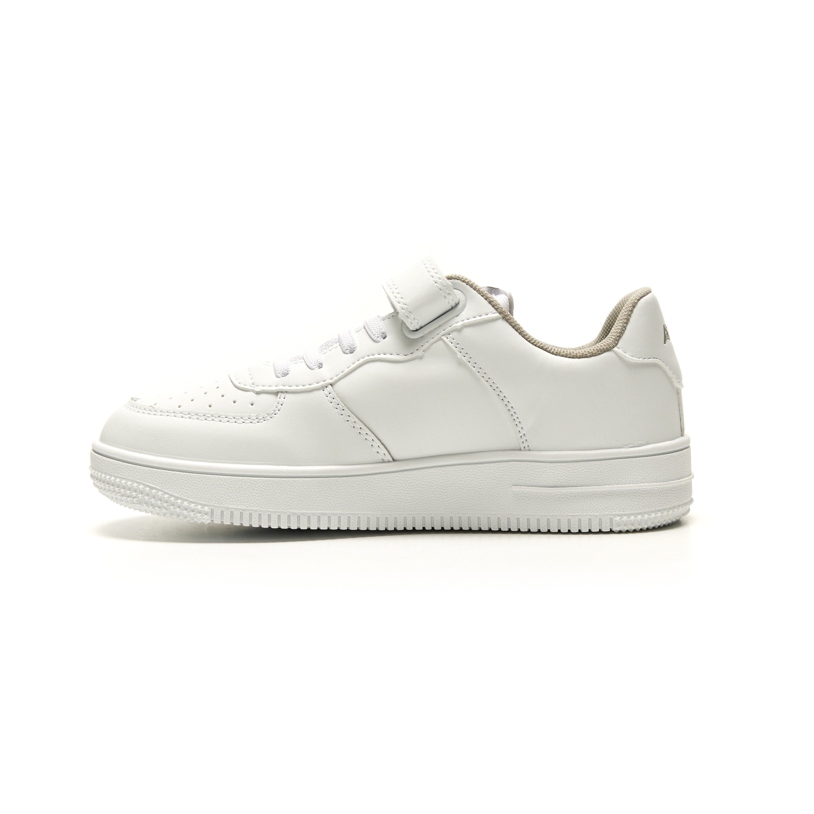
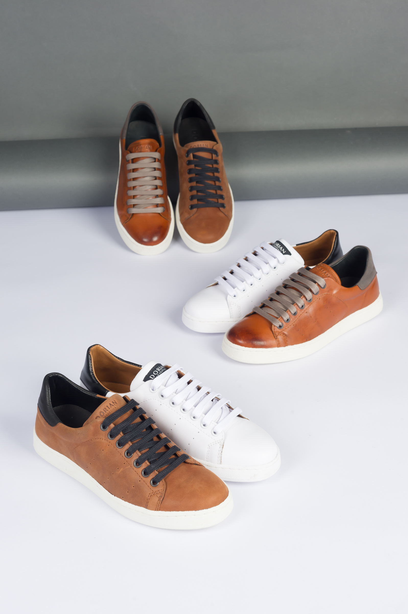
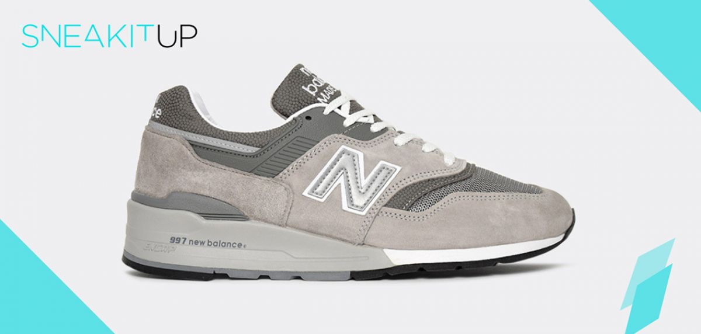

# Zapatillas

Las zapatillas son un tipo de calzado cómodo y versátil, diseñado principalmente para actividades deportivas, aunque también se usan en la vida diaria.  
Ofrecen soporte, amortiguación y estilo, adaptándose a diferentes necesidades y gustos.

# Zapatillas de vestir

Las zapatillas para vestir combinan estilo y comodidad, siendo una opción moderna y versátil para looks casuales o semiformal. Su diseño elegante permite usarlas con jeans, pantalones de vestir o incluso trajes, aportando un toque relajado sin perder sofisticación.

# Zapatillas de entrenamiento

Las zapatillas de entrenamiento están diseñadas para ofrecer soporte, estabilidad y comodidad durante rutinas de ejercicio. Suelen tener suelas resistentes, buena amortiguación y materiales transpirables, ideales para actividades como el gimnasio, el entrenamiento funcional o clases dirigidas.

# Zapatillas del día a día

Las zapatillas para el día a día destacan por su comodidad y diseño práctico, ideales para acompañar la rutina sin sacrificar estilo. Son ligeras, transpirables y versátiles, adaptándose a diferentes actividades y combinaciones de ropa.

## Precios

**Gama baja y media (USD):**
- 20
- 30
- 40
- 55

**Gama alta y de lujo (USD):**
- 200
- 300
- 600
- 1500

## Páginas de zapatillas

- [Marca Nike](https://www.nike.com.ar)  
- [Marca Adidas](https://www.adidas.com.ar)  
- [Marca New Balance](https://www.newbalance.com.ar)  
- [Marca Louis Vuitton](https://eu.louisvuitton.com)
